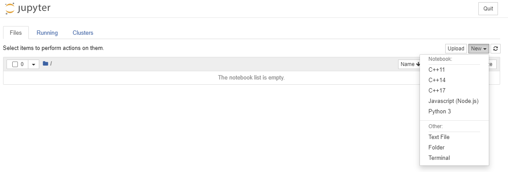
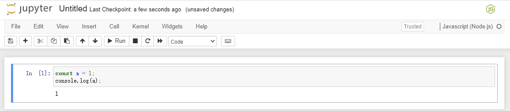
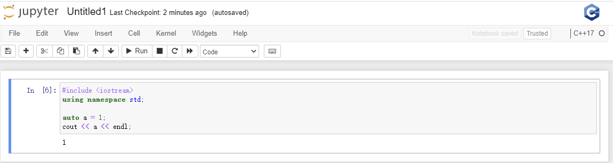

# jupyter-x
Your can practice javascript, c++ more than python in jupyter notebook.


- kernels


- javascript example


- cpp example


- build the docker image.
```angular2
docker build . -t jupyterx
```

- start docker container.
```angular2
docker run -it --name $YOUR_CONTINER_NAME -p $YOUR_HOST_PORT:9999 -v $YOUR_HOST_DIR:/notebooks -d jupyterx
```

- if you use docker toolbox in windows, pay attention to the mount path, make sure it can mount to your host not only the virtulbox docker machine.

```angular2
docker run -it --name $YOUR_CONTINER_NAME -p $YOUR_HOST_PORT:9999 -v /c/Users/user/workplace/jupyternotebooks/:/notebooks -d jupyterx
```